# Chemicals In Cosmetics Dataset

###### Photo Source: Google
Do you ever wonder what ingredients are in your favorite cosmetics? Did you know that there are over 12,000 chemicals used in cosmetics and personal care products?
A chemical is any substance that has a defined composition. In other words, a chemical is always made up of the same “stuff.” Some chemicals occur in nature, such as water. Other chemicals are manufactured, such as chlorine (used for bleaching fabrics or in swimming pools). Chemicals are all around you: the food you eat, the clothes you wear. You, in fact, are made up of a wide variety of chemicals. But in this context and for the purpose of this analysis, we will be focusing on the chemicals in your cosmetics and personal care products.

**Cosmetics** are constituted mixtures of chemical compounds derived from either natural resources, or synthetically created ones. Cosmetics have various purposes. Those designed for personal care and skin care can be used to cleanse or protect the body or skin. Cosmetics designed to enhance or alter one’s appearance (makeup) can be used to conceal blemishes, enhance one’s natural features (such as the eyebrows and eyelashes), add color to a person’s face, or change the appearance of the face entirely to resemble a different person, creature or object. Cosmetics can also be designed to add fragrance to the body.
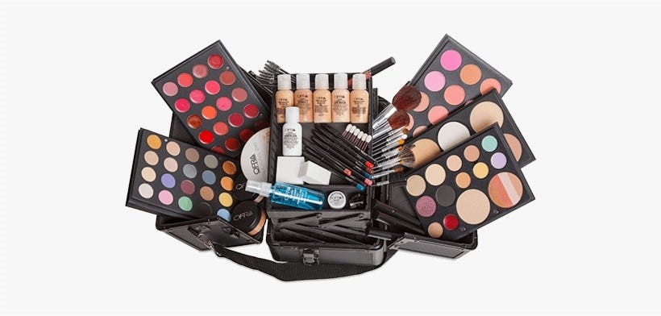
###### Photo Source: Google

## About the Dataset
This data reflect information that has been reported to the California Safe Cosmetics Program (CSCP) in the California Department of Public Health (CDPH). The primary purpose of the CSCP is to collect information on hazardous and potentially hazardous ingredients in cosmetic products sold in California and to make this information available to the public. For all cosmetic products sold in California, the California Safe Cosmetics Act (“the Act”) requires the manufacturer, packer, and/or distributor named on the product label to provide to the CSCP a list of all cosmetic products that contain any ingredients known or suspected to cause cancer, birth defects, or other developmental or reproductive harm.
To assist companies with reporting, CDPH has compiled a list of reportable ingredients based on lists and reports available from the authoritative scientific bodies cited in the Act to cause cancer or reproductive harm; it is meant to serve as guidance and is not all-inclusive. Companies with reportable ingredients in their products must submit information to the California Safe Cosmetics Program.

## Objective of the project
The objective of this project is to get to know more about the chemicals used in cosmetics and personal care products and to answer a few questions about it. I decided to use Microsoft SQL server for the exploration and analysis of this data and then use Tableau for the Visualization.
So what’s really in your makeup bag? Scroll through and take a look at some of the most popular cosmetics ingredients.

## About the Dataset
Do you ever wonder what ingredients are in your favorite cosmetics? Did you know that there are over 12,000 chemicals used in cosmetics and personal care products? This dataset contains information on the chemicals used in cosmetics, including the name of the chemical, the company that manufactures it, the primary category it is used in, and the date it was first reported. So what's really in your makeup bag?
This dataset contains information on chemicals used in cosmetics, including the name of the chemical, primary category, subcategory, product name and the company that uses it, the category of cosmetic it is used in, and the date it was first reported.
This dataset was downloaded from Kaggle, the data was made up of 114,298 rows and 23 columns.

### Data Cleaning and Exploration
Data cleaning and exploration was done using SQL. was done where necessary using the update command. Excess spaces were also removed where necessary using the Trim command making the data ready for analysis.

## Data Collection
This data was downloaded from Kaggle. It contains 114,298 rows and 23 columns. The columns contained information such as
##### *  Index — Serial Number
##### *  CDPHId -The California Department of Public Health (CDPH) internal identification number for product.
##### _ ProductName — Product name as entered by manufacturer, packer and/or distributor.
##### _ CSFId- CDPH internal identification number for a color/scent/flavor.
##### _ CSF — Color, scent and/or flavor as entered by manufacturer, packer and/or distributor.
##### _ CompanyId — CDPH internal identification number for company.
##### _ Company Name — Company name as entered by manufacturer, packer and/or distributor.
##### _ BrandName — Brand name as entered by manufacturer, packer and/or distributor. .
##### _ PrimaryCategoryId — CDPH internal identification number for category.
##### _ PrimaryCategory — Type of product (13 primary categories: Baby Products, Bath Products, Fragrances, Hair Care Products (non-coloring), Hair Coloring Products, Makeup Products (non-permanent), Nail Products, Oral Hygiene Products, Personal Care Products, Shaving Products, Skin Care Products, Sun-Related Products, Tattoos and Permanent Makeup).
##### _ SubCategoryId — CDPH internal identification number for subcategory.
##### _ SubCategory — Type of product within one of the 13 primary categories.
##### _ CasId — CDPH internal identification number for chemical.
##### _ CasNumber — Chemical identification number
##### _ ChemicalId — CDPH internal identification number for this chemical’s record specific to this product.
ChemicalName — Name of chemical substance in cosmetic product. Note that chemical substances may have more than one Chemical Name.
##### _ InitialDateReported — Date the product profile was created by manufacturer, packer and/or distributor, that is, the date that the product was first reported to CDPH.
##### _ MostRecentDateReported — Date the product profile was last modified by manufacturer, packer and/or distributor.
##### _ DiscontinuedDate — If applicable, date the product was discontinued.
##### _ ChemicalCreatedAt — The date that this chemical was first reported to CDPH for this product.
##### _ ChemicalUpdated At — Date this chemical report was last modified by manufacturer, packer and/or distributor. This field is unique from the product profile.
##### _ ChemicalDateRemoved — If applicable, date the chemical was removed from product, i.e., reformulation.
##### _ ChemicalCount — Total number of current chemicals reported for this product. This number does not include chemicals that have been removed from a product. This number is a calculated field based on current reporting.
The link to the dataset can be found [here](https://www.kaggle.com/datasets/thedevastator/chemicals-in-cosmetics-what-s-really-in-your).

## Data Cleaning
I created a database called “Chemicals_In_Cosmetics” and then imported the data in a comma separated value (csv) format into Microsoft SQL server using the import and export wizard.
It was quite a messy one, so definitely before proceeding to anything else, the data had to be cleaned to make it suitable to be used for further analysis and decision making. Some of the steps I took to clean the data was removing excess spaces using the trim command, formatting all columns correctly, checking for duplicates, null values, unprintable characters and misspellings.
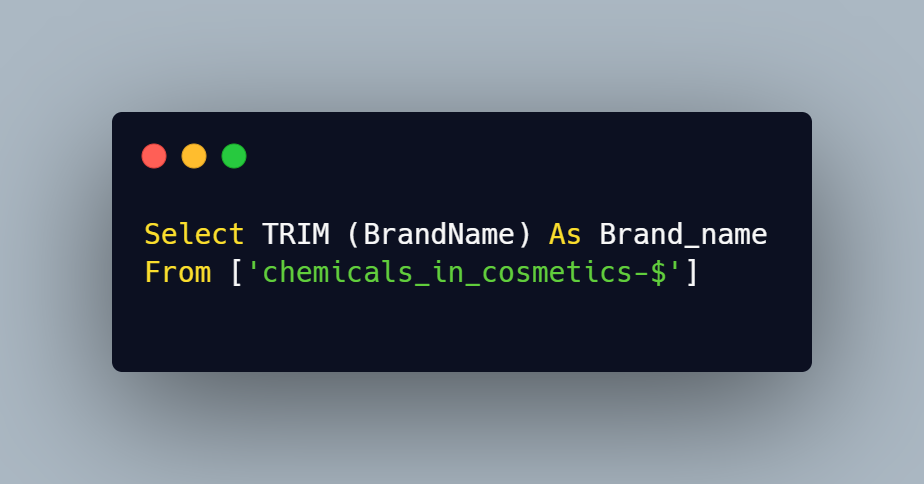
###### Using Trim Command to remove extra spaces from the Brand Name column
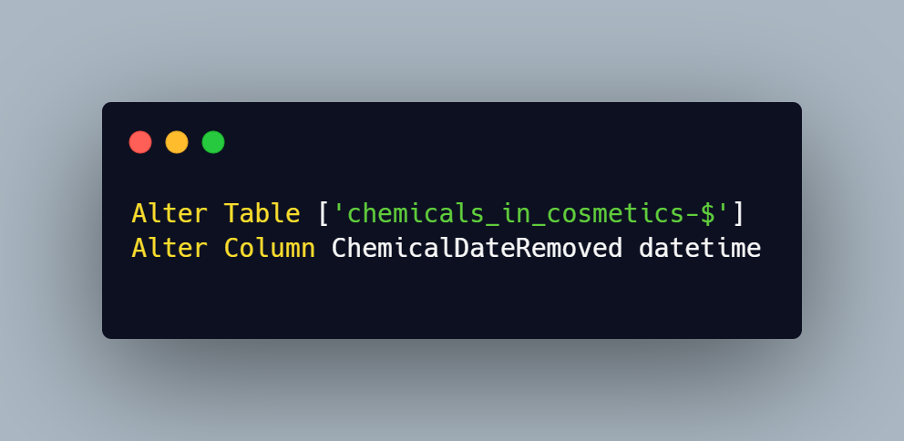
###### Formatting the ChemicalDateRemoved column to Datetime
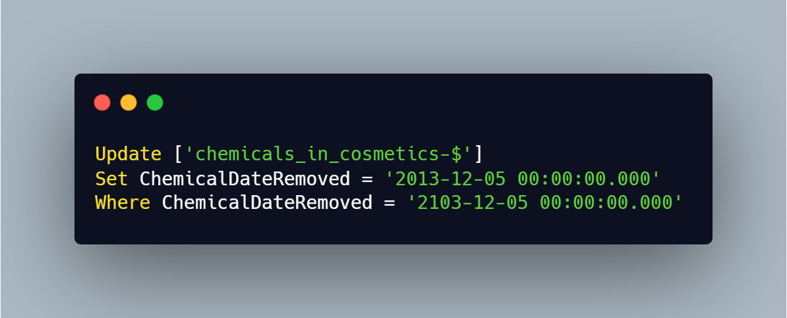
###### Correcting the date in the ChemicalDateRemoved Column
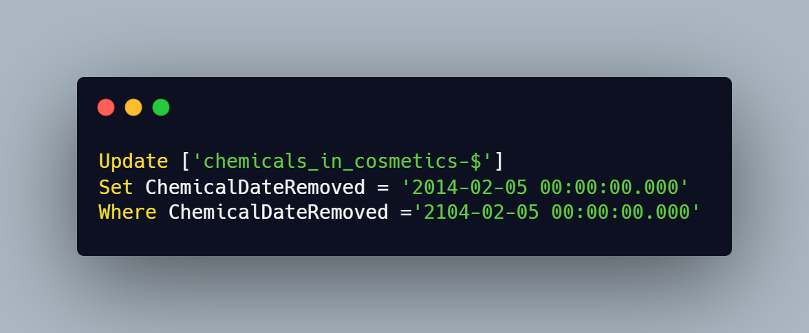

## Analysis
After cleaning the data, I had to write queries to answer few questions about the data. Some of which are:

1: Chemicals used most in Cosmetic and Personal Care Products and showing the result in descending order
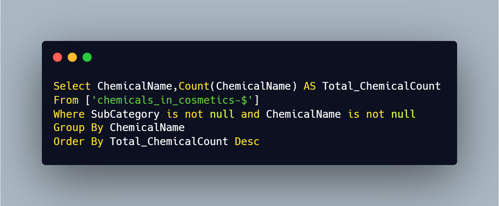

The result of this query showed that Titanium Oxide is the most used chemical in cosmetic and personal care product with a count of 93,252. It was followed by Silica, crystalline with a count of 2742 and then retinol/retilyn esters with a count of 2154.
Also, Arsenic (inorganic oxides) Cocamide, Spironolactone, Phenacemide, Extract of coffee bean, Diethanolamides of the fatty acids of coconut oil, Sodium Bromate, Acetylsalicylic acid, N-Nitroso-diethanolamine, Cocamide diethanolamine Vinyl acetate, Retinol palmitate, Distillates (coal tar), 2-Propyleneacrolein were the least used chemicals with a count of 1 respectively.

2. Companies that used most reported chemicals in their cosmetics and personal care products.
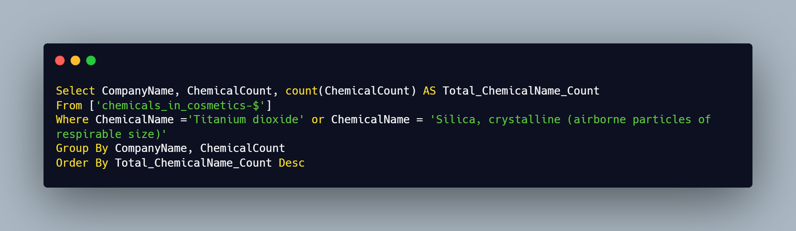
The result of this query showed that L'Oréal USA is the company that used most reported chemicals in their cosmetics and personal care product with a count of 5,738 followed by Revlon Consumer Product Corporation with a count of 4,202 and Bare Escentuals Beauty, Inc. with a count 3,679

The companies with the least reported chemicals were Zalan Products, Inc. with a count of 1, University Medical Pharmaceuticals Corp with a count of 1 and Cosmetic Dermatology Inc. with a count of 1 respectively.

3. Identify the brands that had chemicals which were mostly reported in 2018.
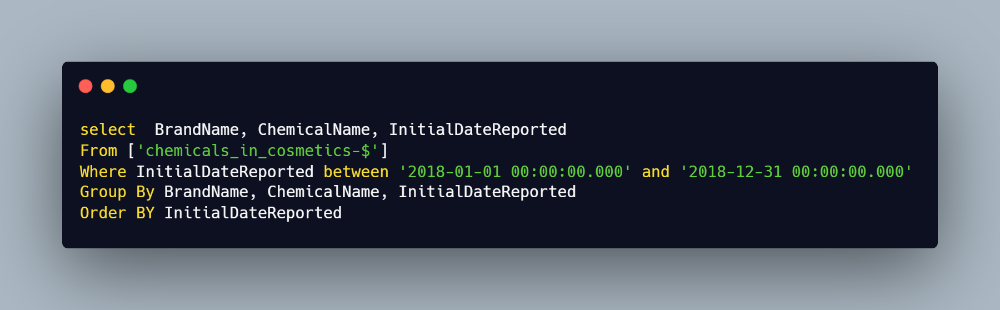
The result of this query showed Brands that had chemicals that were mostly reported in 2018

4. Which brands had chemicals discontinued and removed?
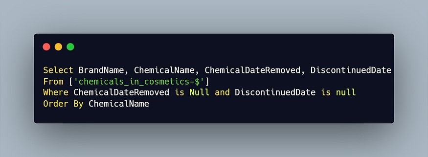

The result of this query showed chemicals that were discontinued and removed

5. Identify the period between the creation of the removed chemicals and when they were actually removed
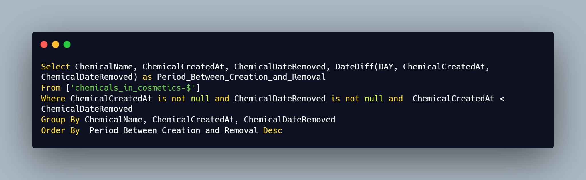
This query showed the difference in the days between the day of creation and the date of removal of a chemical.

6. How long were removed chemicals in baby products used?
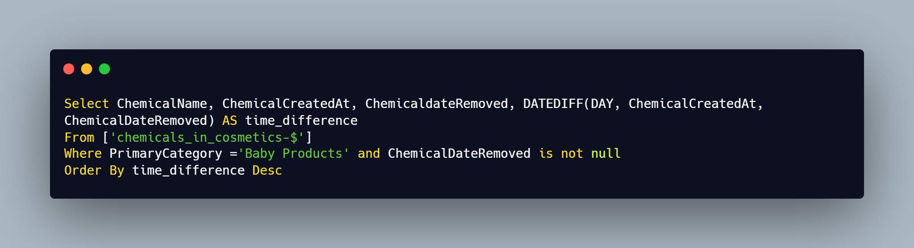
The result of this query showed that it took 2097 days for Titanium dioxide to be removed from baby products and it took Cocamide diethanolamine Trade Secret 545 days and 13 days respectively.

## Visualization
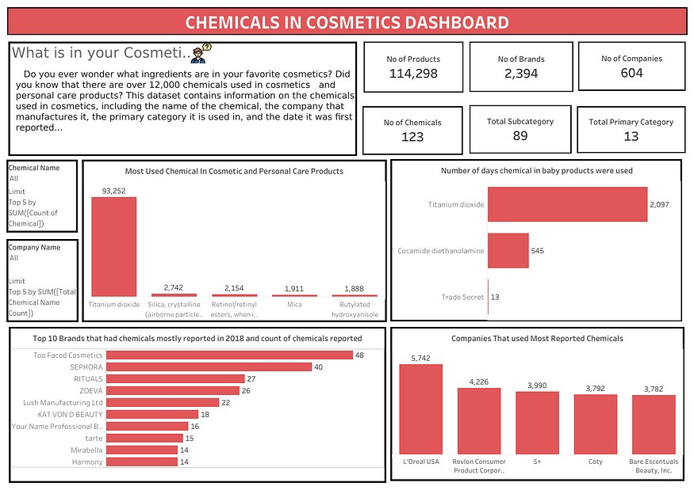
Chemicals In Cosmetics Dashboard

## Insights
.From my analysis, it shows that Titanium Dioxide is the most used chemical in cosmetics and personal care products.
.I also found out that the brand that had most reported chemicals in 2018 was Two faced cosmetics.
. The analysis also showed that the company that used most reported chemicals for production was L'Oréal USA.
. Also the analysis showed that Titanium Dioxide, Cocamide diethanolamine and Trade Secret were used for 2,097, 545 and 13 days respectively in baby products.

## Conclusion
Now we have information on the chemicals in our cosmetics and personal care products which will help in making further informed decisions.
**Thank you for reading** :gift_heart:

